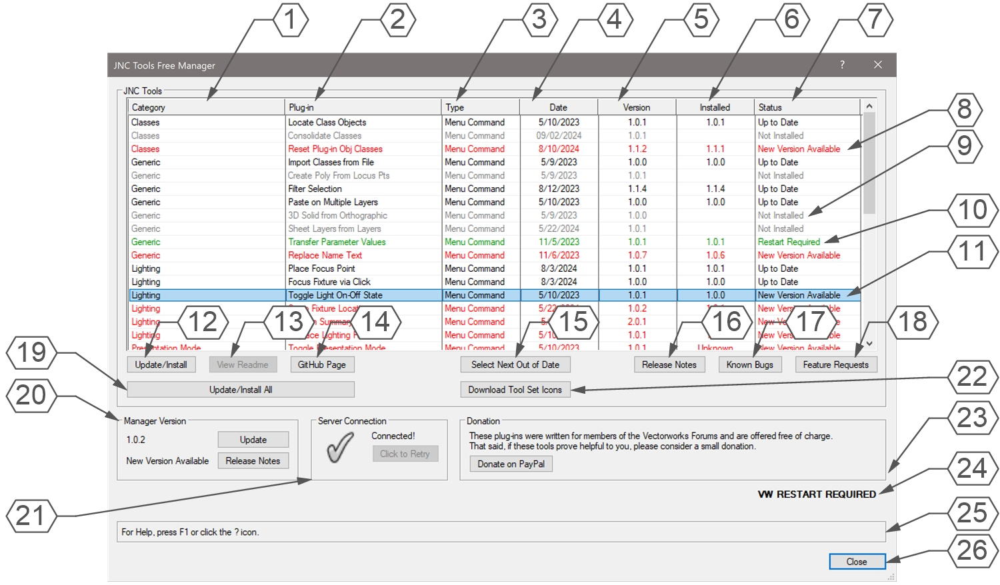

# JNC Tools Free Manager

Menu Command

## Version

0.9.5 - 8/17/2024

This plug-in is written in Vectorscript (Pascal) and can be used in any version of [Vectorworks](https://www.vectorworks.net) 2019 or newer.

## Description

Used to manage the free JNC Tools plug-ins for Vectorworks. Allows for installation and updating of plug-ins, opening up Readme documents, and reading of Release Notes, Known Bugs, and active Feature Requests.

## Instructions

1. Run menu command.
2. Select a plug-in from the List Browser window.
3. Use the buttons at the bottom of the List Browser to **Update / Install** selected plug-in, **View Readme** of selected plug-in, and view the selected plug-in's **Release Notes**, **Known Bugs**, or active **Feature Requests**.
4. Press the **Select Next Out of Date** to cycle to the next plug-in with a new version available.
5. Press the **Update/Install All** button to install all missing plug-ins and update all plug-ins that are out of date.
6. If there is a newer version of this Manager, a message will alert the user when the menu command runs and the **Update** button will be active in the **Manager Version** box in the lower-left corner of the dialog box. Pressing the **Update** button will download the most current version.
7. If the Manager or a plug-in has been updated, the user will be prompted to restart Vectorworks after closing the dialog.

## Dialog Box Explanation

1. Column listing the category of the Plug-in.
2. Column listing the name of the Plug-in.
3. Column listing the type of the Plug-in (**Menu Command**, **Tool**, or **Plug-in Object**).
4. Column listing the date of the most current version of the Plug-in.
5. Column listing the version number of the most current version of the Plug-in.
6. Column listing the version number of the currently installed Plug-in.
7. Column listing the current status of the Plug-in (**Up to Date**, **Not Installed**, **New Version Available**, or **Restart Required**).
8. Plug-ins not currently installed will be shown in Gray.
9. Plug-ins with newer versions available will be shown in Red.
10. The currently selected Plug-in will be highlighted in the List Browser. Only one plug-in may be selected at a time.
11. Plug-ins which have been updated will be shown in Green.
12. Press the **Update/Install** button to update or install the currently selected Plug-in. This action cannot be undone.
13. Press the **View Readme** button to open the README page for the currently selected plug-in on the system's default Web Browser. If this button is disabled, a README page is not yet available for the selected plug-in. If no plug-ins are selected, the button will open the README page for the **JNC Tools Free Manager**.
14. Press the **GitHub Page** button to open the GitHub page hosting the selected Plug-in on the system's default Web Browser.
15. Press the **Select Next Out of Date** button to highlight/select the next plug-in with a new version available. If all plug-ins are currently up to date, the system will beep.
16. Press the **Update/Install All** button to install all Plug-ins marked "*Not Installed*" and to update all plug-ins marked "*New Version Available*". This action cannot be undone.
17. Press the **Release Notes** button to open a window displaying a detailed breakdown of every version of the selected Plug-in.
18. Press the **Known Bugs** button to open a window displaying all currently known bugs with the selected Plug-in. If no known bugs exist, no window will be opened and the system will beep.
19. Press the **Feature Requests** button to open a window displaying planned features for the selected Plug-in. If no features are currently planned for the Plug-in, no window will open and the system will beep.
20. **Manager Version Box** containing information about the Manager. The box contains the current verion number and status, a button to display the Manager's **Release Notes**, and a button to download an **Update** for the Manager. If the most current version of the Manager is already installed, the **Update** button will be disabled.
21. **Server Connection Box** showing the connection to the GitHub page for the selected Plug-in. If the box contains a Red X, the Plug-in is either missing from the GitHub page or the internet has become disconnected since running the menu command. Press the **Click to Retry** button to attempt to reconnect to the page.
22. **Donation Box** containing donation information. Press the **Donate on PayPal** button to open a webpage linked to the developer's PayPal account in the system's default Web Browser. Donations are not at all expected but are certainly appreciated.
23. If a restart of Vectorworks is required, it will be shown here.
24. **Help Box**, mousing over any dialog box element will display an explanation here.
25. Press the **Close** button to close the dialog box.

## Installation Instructions

## Adding the Plug-in to your Workspace

1. Open the **Workspace Editor** by going to **Tools - Workspaces - Edit Current Workspace**
2. Select the **Menus** tab
3. In the box on the left, find and expand the **JNC** category
4. In the box on the right, find a suitable menu to place the command in, such as **Tools** or **Modify**
5. Click and drag the **JNC Tools Free Manager** command from the box on the left to the desired menu location in the box on the right
6. Click **OK** to close the editor

## Localization Instructions

The plug-in can be localized to your native language without having access to the source code.  This can be achieved by following the instructions below:

1. Open the **Plug-in Manager** by going to **Tools - Plug-ins - Plug-in Manager**
2. Select the **Third-party Plug-ins** tab
3. Select the **JNC Tools Free Manager** command
4. Click the **Customize** button
5. Select the **Strings** tab
6. Double-click a category, such as **Dialog Strings**
7. Select a string to edit and press the **Edit** button
8. Write a new string and press the **OK** button until you are back to the **Plug-in Manager**

The categories for this plug-in are as follows:

- **3000** - *Dialog Strings*: These strings are used in the dialog box and can all freely be changed.
- **4000** - *Dialog Help Strings*: These strings are used in the Help Box at the bottom of the dialog box and can all freely be changed.
- **5000** - *Status Strings*: These strings are used to populate the **Status** column of the dialog box and can all be freely changed as long as the changes still accurately represent the original status.
- **6000** - *Misc Strings*: These strings serve multiple purposes in the code, but are mostly Alerts that appear in dialog boxes.  Do not change **6000** or **6001**, but all others can be changed.
- **7000** - *Plug-in Directory*: This string serves as the sub-directory of the **User Folder/Plug-ins** folder where any new plug-ins will be installed.  By default, this will by **User Folder/Plug-ins/JNC Tools/Free/**.  Any path can be specified as long as it uses "**/**" as a delimiter.

## Release Notes

| Date | Version | Note |
| :---: | :---: | :--- |
| 08/16/2024 | 0.9.0 | Beta Test |
| 08/17/2024 | 0.9.1 | Beta Test 2 |
| 08/17/2024 | 0.9.2 | Fixed bug with Update Manager button |
| 08/17/2024 | 0.9.3 | Fixed bug with updating plug-in on row 1 |
| 08/17/2024 | 0.9.4 | Release Candidate |

## Known Bugs

No Known Bugs

## Feature Requests

No current Feature Requests

## License

Copyright (c) Jesse Cogswell (JNC Tools)

Permission is hereby granted, free of charge, to any person or organization
obtaining a copy of this software (the "User") and associated documentation files (the "Software"),
to use, reproduce, distribute, execute, and transmit the Software.

The User is not permitted to modify or attempt to reverse engineer the source code.  The User may
localize the Software using approved methods from within the Vectorworks software.

THE SOFTWARE IS PROVIDED "AS IS", WITHOUT WARRANTY OF ANY KIND, EXPRESS OR
IMPLIED, INCLUDING BUT NOT LIMITED TO THE WARRANTIES OF MERCHANTABILITY,
FITNESS FOR A PARTICULAR PURPOSE, TITLE AND NON-INFRINGEMENT. IN NO EVENT
SHALL THE COPYRIGHT HOLDERS OR ANYONE DISTRIBUTING THE SOFTWARE BE LIABLE
FOR ANY DAMAGES OR OTHER LIABILITY, WHETHER IN CONTRACT, TORT OR OTHERWISE,
ARISING FROM, OUT OF OR IN CONNECTION WITH THE SOFTWARE OR THE USE OR OTHER
DEALINGS IN THE SOFTWARE.